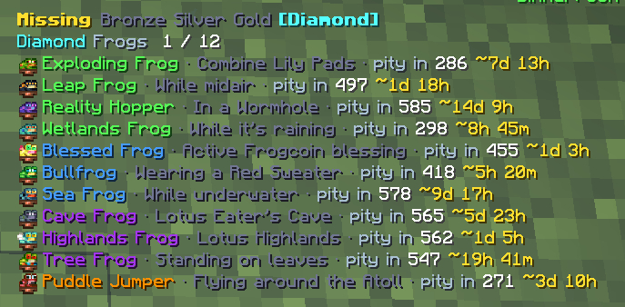
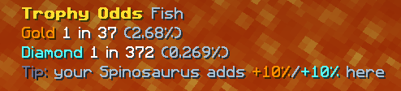
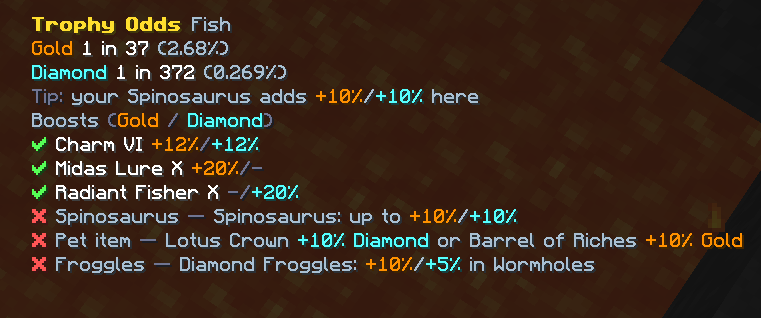
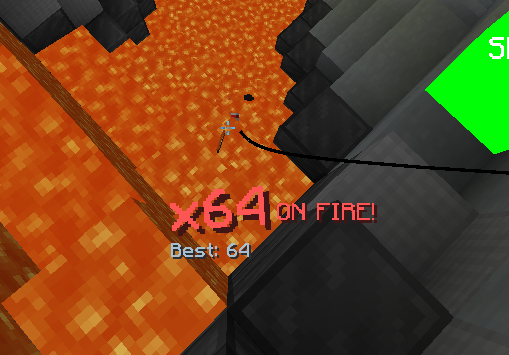
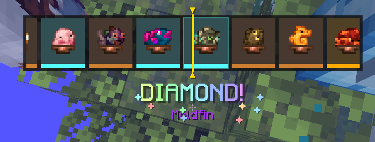
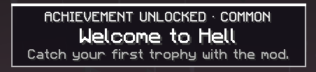
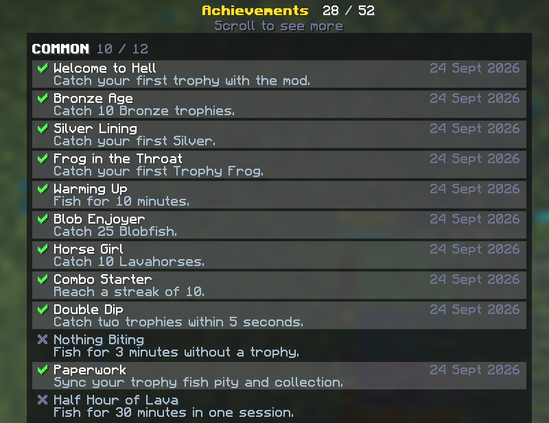

<div align="center">


# IHateTrophyFishing

A Trophy Fish and Trophy Frog tracker for Hypixel SkyBlock: catch rates, time until pity, your real
Gold and Diamond odds, and a few things to make the grind hurt less. Works on its own, no other mods needed.

[](https://modrinth.com/mod/i-hate-trophy-fishing)
[](https://github.com/DeveloperGr3y/IHateTrophyFishing/releases)
[](https://github.com/DeveloperGr3y/IHateTrophyFishing/releases/latest)
[](#installing)
[](LICENSE)

**[Modrinth](https://modrinth.com/mod/i-hate-trophy-fishing)** · **[Releases](https://github.com/DeveloperGr3y/IHateTrophyFishing/releases)** · **[Report a bug](https://github.com/DeveloperGr3y/IHateTrophyFishing/issues)**

</div>

## Features

**Trophy Tracker.** Catches per hour for every fish and frog, split by session, today or all time.
Anything you're still missing a Gold or Diamond of shows how many catches are left until pity and
roughly how long that'll take at your current pace. Sorted by rarity, with icons and rarity colours.


**Syncing your data.** Do each once and the mod remembers it (`/ihtf sync` shows what's left):
- Fish pity: `/pity` → Crimson Isle. Frog pity: `/pity` → Lotus Atoll.
- Which fish you own: talk to Odger (Trophy Fish). Which frogs you own: talk to Researcher Ribery.
- For Trophy Odds: open Marigold's and Gemma's shops, `/pets`, and your Attribute Menu (search "Frog"), and hold
  your rod. You'll get a chat message as each one syncs.

**Missing Trophies.** A to-do list of what you haven't caught yet, one tier at a time, with where to catch each
one and how close you are to pity. Click the tiers with your inventory open to flick between them.



**Trophy Odds.** Your chance of a Gold or Diamond on the next trophy, worked out from everything that boosts it:
Charm, Midas Lure, Radiant Fisher, your Spinosaurus or Mythic Frog pet (up to +10% each) and its item, the frog
shards, and Froggles in Wormholes. Anything it hasn't read yet is flagged with what to open. Open your inventory for
the full breakdown, and hover any boost to see what it is. It'll also suggest a pet or helmet you already own when
it'd help.





**Currently Targeting.** A second display listing everything you've caught in the last 10 minutes.
Handy when you're stacking conditions for a few fish at once.


**Slugfish Timer.** Counts up from each cast and dings when a bite is late enough to be a Slugfish.
You can pick the sound.

**Streaks.** An osu!-style counter for trophies caught in a row. Keep catching (one every 15 seconds) and it gets
louder and flashier; when it ends you get a chat message with buttons to share it in party, guild or all chat.
Lives in the Dopamine Enhancers tab, which has a master switch if you'd rather not.



**Roulette.** Catch a Gold or Diamond and a CS:GO-style case opening spins through trophy cards before landing on
yours. Can be limited to your first of each, or turned off. Try it with `/ihtf roulette`.



**Achievements.** 52 of them, from Common to Divine, that unlock as you fish: first Golds, long sessions, big
streaks, full collections, and a few hidden ones. The rarer the achievement, the bigger the moment: a quick
chime for a Common, up to a drumroll, totem animation and confetti for the top tiers. See yours with
`/ihtf achievements`.





**The small stuff.**
- Only counts time you're actually fishing, so AFK doesn't wreck your rates.
- Only shows up on the Crimson Isle and Lotus Atoll while you're fishing or holding a rod (configurable).
- Pause, reset or switch view by clicking the tracker with your inventory open.
- Hide trophies you already have a Gold or Diamond of.
- New catches flash green.
- Move and resize everything from the GUI tab in `/ihtf`.


## Commands

| Command | |
|---|---|
| `/ihtf` | Settings |
| `/ihtf gui` | Move and resize the displays |
| `/ihtf achievements` | See your achievements |
| `/ihtf sync` | Show which trophy data still needs syncing |
| `/ihtf reset` | Start a new session |
| `/ihtf roulette [gold]` | Test the roulette |

## Installing

1. Install [Fabric Loader](https://fabricmc.net/use/) 0.19.5+ for Minecraft 26.1.x or 26.2, and
   [Fabric API](https://modrinth.com/mod/fabric-api).
2. Download the jar for your Minecraft version from [Modrinth](https://modrinth.com/mod/i-hate-trophy-fishing) or
   [Releases](https://github.com/DeveloperGr3y/IHateTrophyFishing/releases) (`+mc26.1` or `+mc26.2`).
3. Drop it in your `mods` folder. Kotlin and MoulConfig are bundled, and it needs Java 25.

Release notes include SHA-256 checksums if you want to check your download.

## Heads up

I wrote this with a lot of help from AI (Claude). I use it myself, but nobody else has reviewed it yet, so read the
source if that matters to you.

It only reads chat, menus, the tab list and the scoreboard. It never fishes, clicks or sends anything for you, and
the share buttons only post when you click them.

## Building

```
./gradlew build
```

Needs JDK 25. One codebase builds a jar per Minecraft version (via [Stonecutter](https://stonecutter.kikugie.dev/)),
all in `build/libs/`. Version-specific code lives in `util/Compat.kt`.

## Contributing

Bug reports and ideas are welcome in [Issues](https://github.com/DeveloperGr3y/IHateTrophyFishing/issues).

Open a PR against `main` with a [Conventional Commit](https://www.conventionalcommits.org/) title, e.g.
`feat: add a Golden Fish timer` or `fix: ignore guild chat`. `feat` bumps the minor version, `fix` the patch,
and `feat!:` (breaking) the major. PRs are squash-merged, and [release-please](https://github.com/googleapis/release-please)
turns them into a release PR with the changelog; merging that publishes the release with the jars attached.

## Credits

- Inspired by [SkyHanni](https://github.com/hannibal002/SkyHanni)'s trophy features.
- Trophy data from the [NEU repo](https://github.com/NotEnoughUpdates/NotEnoughUpdates-REPO); frog and
  `/pity` formats from [Feesh](https://github.com/Sleepy-Panda/Feesh) and [Devonian](https://github.com/Synnerz/devonian).

Licensed CC0. Third-party licences are in [THIRD_PARTY_NOTICES.md](THIRD_PARTY_NOTICES.md).
