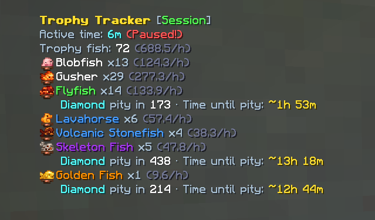
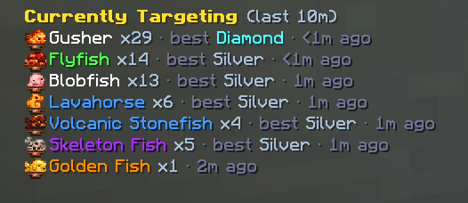
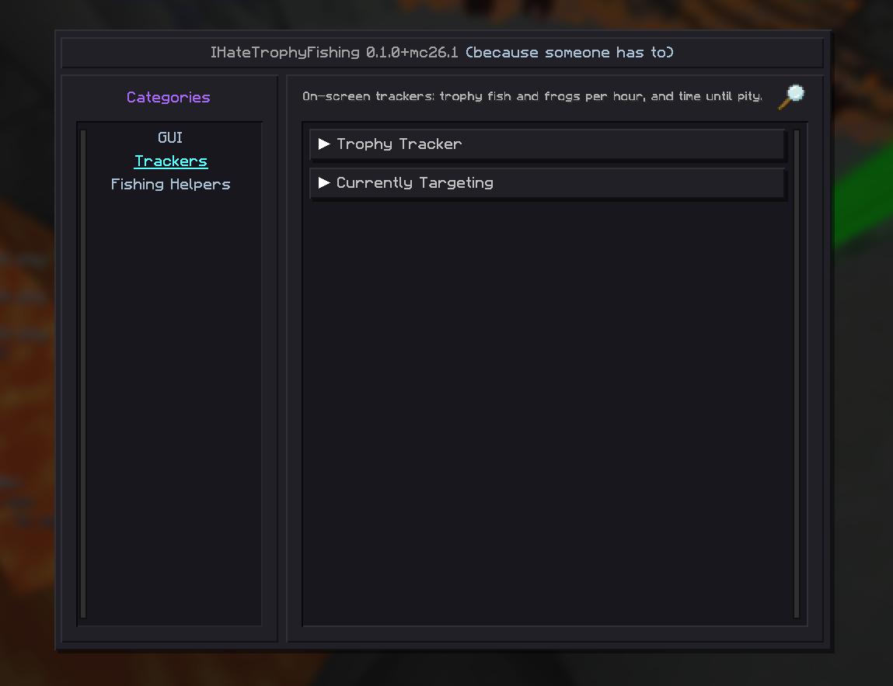

# IHateTrophyFishing

A Fabric mod for Hypixel SkyBlock that tracks your Trophy Fish and Trophy Frogs and tells you how long
you've got until pity. Works on its own, no SkyHanni needed.

Minecraft 26.1.x and 26.2 · Fabric Loader 0.19.5+ · Fabric API · Java 25

## Features

**Trophy Tracker.** Catches per hour for every fish and frog, split by session, today or all time.
Anything you're still missing a Gold or Diamond of shows how many catches are left until pity and
roughly how long that'll take at your current pace. Sorted by rarity, with icons and rarity colours.



**Pity sync.** Open `/pity` once and the tracker uses Hypixel's own pity numbers. Open Odger (or
Researcher Ribery for frogs) once and it knows what you've already caught.

**Currently Targeting.** A second display listing everything you've caught in the last 10 minutes.
Handy when you're stacking conditions for a few fish at once.



**Slugfish timer.** Counts up from each cast and dings when a bite is late enough to be a Slugfish.
You can pick the sound.

**Streaks.** An osu!-style counter for trophies caught in a row. Keep catching (one every 15 seconds) and it gets
louder and flashier; when it ends you get a chat message with buttons to share it in party, guild or all chat.
Lives in the Dopamine Enhancers tab, which has a master switch if you'd rather not.

**Roulette.** Catch a Gold or Diamond and a CS:GO-style case opening spins through trophy cards before landing on
yours. Can be limited to your first of each, or turned off. Try it with `/ihtf roulette`.

**The small stuff.**
- Only counts time you're actually fishing, so AFK doesn't wreck your rates.
- Only shows up on the Crimson Isle and Lotus Atoll while you're fishing or holding a rod (configurable).
- Pause, reset or switch view by clicking the tracker with your inventory open.
- Hide trophies you already have a Gold or Diamond of.
- New catches flash green.
- Move and resize everything from the GUI tab in `/ihtf`.



## Commands

| Command | |
|---|---|
| `/ihtf` | Settings |
| `/ihtf gui` | Move and resize the displays |
| `/ihtf reset` | Start a new session |
| `/ihtf roulette [gold]` | Test the roulette |

## Installing

Grab the jar for your Minecraft version from [Releases](../../releases) and drop it in your mods folder
next to Fabric API. Kotlin and MoulConfig are bundled.

## Heads up

- I wrote this with a lot of help from AI (Claude). I use it myself, but nobody else has reviewed it yet,
  so read the source if that matters to you.

## Building

```
./gradlew build
```

Needs JDK 25. One codebase builds a jar per Minecraft version (via [Stonecutter](https://stonecutter.kikugie.dev/)),
all in `build/libs/`. Version-specific code lives in `util/Compat.kt`.

## Contributing

Open a PR against `main` with a [Conventional Commit](https://www.conventionalcommits.org/) title, e.g.
`feat: add a Golden Fish timer` or `fix: ignore guild chat`. `feat` bumps the minor version, `fix` the patch,
and `feat!:` (breaking) the major. PRs are squash-merged, and [release-please](https://github.com/googleapis/release-please)
turns them into a release PR with the changelog; merging that publishes the release with the jars attached.

## Credits

- Inspired by [SkyHanni](https://github.com/hannibal002/SkyHanni)'s trophy features.
- Trophy data from the [NEU repo](https://github.com/NotEnoughUpdates/NotEnoughUpdates-REPO); frog and
  `/pity` formats from [Feesh](https://github.com/Sleepy-Panda/Feesh) and [Devonian](https://github.com/Synnerz/devonian).

Licensed CC0. Third-party licences are in [THIRD_PARTY_NOTICES.md](THIRD_PARTY_NOTICES.md).
